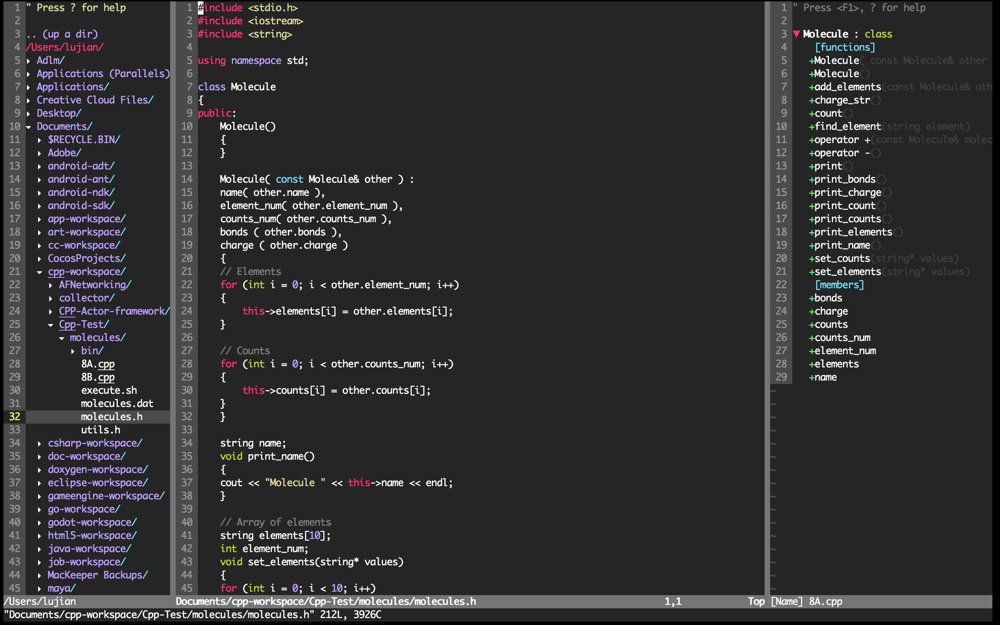

# Vim Configuration

## Screenshot


## Precondition
- On Mac OSX
- Intalled homebrew

## Install
###Step1:
```bash
brew install vim
brew install ctags
cd ~ && git clone https://github.com/Lu-Kye/.my_vim.git
```

###Step2:
```bash
git clone https://github.com/gmarik/Vundle.vim.git ~/.vim/bundle/Vundle.vim
```

###Step3:
```bash
echo source ~/.my_vim/my_vimrc.vim >> ~/.vimrc   
```    

###Step4:
```bash
vim
```
    Type :PluginInstall

###Finally:
    Enjoy yourself
